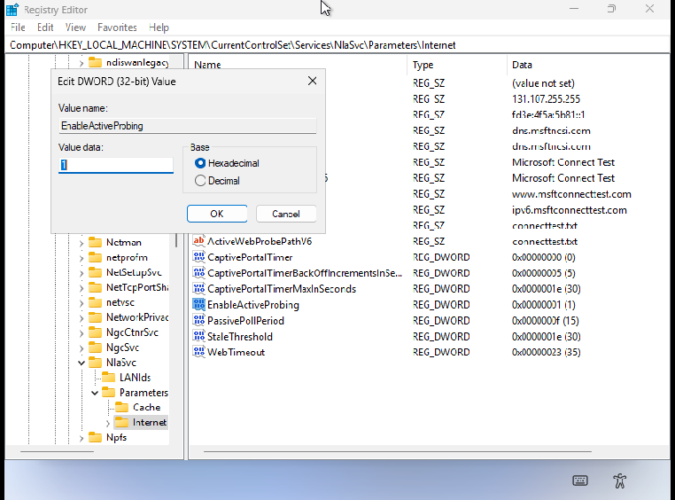

# Disabling captive portal detection

Captive Portal is a mechanism that allow WiFi networks redirect to new connected
devices towards a page to authenticate or accept legal use conditions of the
networks, and once the process is finished, allow or reject the device.

This use to be based in the active probe to check the network connectivity
trying to reach out a HTTP/HTTPS location, and comparing the status code and
response with a well known response for it.

Captive Portals take advantage of this network active probe that workstations,
and network systems implement to redirect users to the above page.

While this enhance the user experience, we could want to disable it if
we don't want such functionality, for instance because we could be
redirected to some content in malicious WiFi networks (is the WiFi
at your hotel trustable? The WiFi at McDonalds? and so on...). The thing is that
a malicious network could redirect us towards a malicious content, and then
redirect to the apparently expected page to accept use conditions or login.

If you had been similar concerns, I hope to give you some clues about how to
disable, so let's start!

## Linux (Network Manager)

**Network Manager**

- Ass the `/usr/lib/NetworkManager/conf.d/90-connectivity.conf` with
  the content:

```ini
[connectivity]
enabled=false
```

- Restart network manager by: `sudo systemctl restart NetworkManager.service`.

> While this disable the active probe for Network Manager, it does not avoid
> other subsystems (browsers) could run their active probes.

## MacOS


## Windows (captive portal probe)

Disable the NCSI (Network Connectivity System Indicator), so no active probes
are launched, and avoid automatic captive portal.



## Browsers

Meanwhile we can disable this behavior at system level, still the browser
do their own probes, and we can disable this probe.

### Firefox

We can disable this by setting the `network.captive-portal-service.enabled` to `false`
from `about:config` site.

Additionally, you can create a `user.js` file in your firefox profile, with the
content below to evoke the same effect:

`~/.mozilla/firefox/<profile>/user.js`


```javascript
user_pref("network.captive-portal-service.enabled", false);
```

> Remember to completely restart the browser if you make some change at 
> `user.js` file.

### Google Chrome

TODO

### Microsoft Edge

TODO

## Mobiles

### Android

Using `adb shell` we run: `settings put global captive_portal_detection_enabled 0`

We check the property is changed by `settings get global_captive_portal_detection_enabled`

### iOS

We need to use [Apple Configurator 2](https://support.apple.com/apple-configurator)
and apply 

## Central proxy

The above works for individual devices; but if you are not using your
devices out of some specific place, you could want to centralize the
management of the above; one option is to use a proxy to access to
internet, and setup rules to reject the probe to the sites used for
the captive portal. Meanwhile this avoid to setup every device, still
make the devices vulnerable to rogue WiFi routers, if the space is
not isolated.

List of endpoints to probe connectivity that trigger captive portal:

```raw
http://captive.apple.com/hotspot-detect.html
http://www.apple.com/library/test/success.html
http://connectivitycheck.gstatic.com/generate_204
http://clients3.google.com/generate_204
http://www.msftncsi.com/ncsi.txt
http://nmcheck.gnome.org/check_network_status.txt
http://networkcheck.kde.org/
http://detectportal.firefox.com/canonical.html
```

## References

- https://en.wikipedia.org/wiki/Captive_portal
- https://support.mozilla.org/en-US/kb/captive-portal
- https://learn.microsoft.com/en-us/windows-server/networking/ncsi/ncsi-overview

